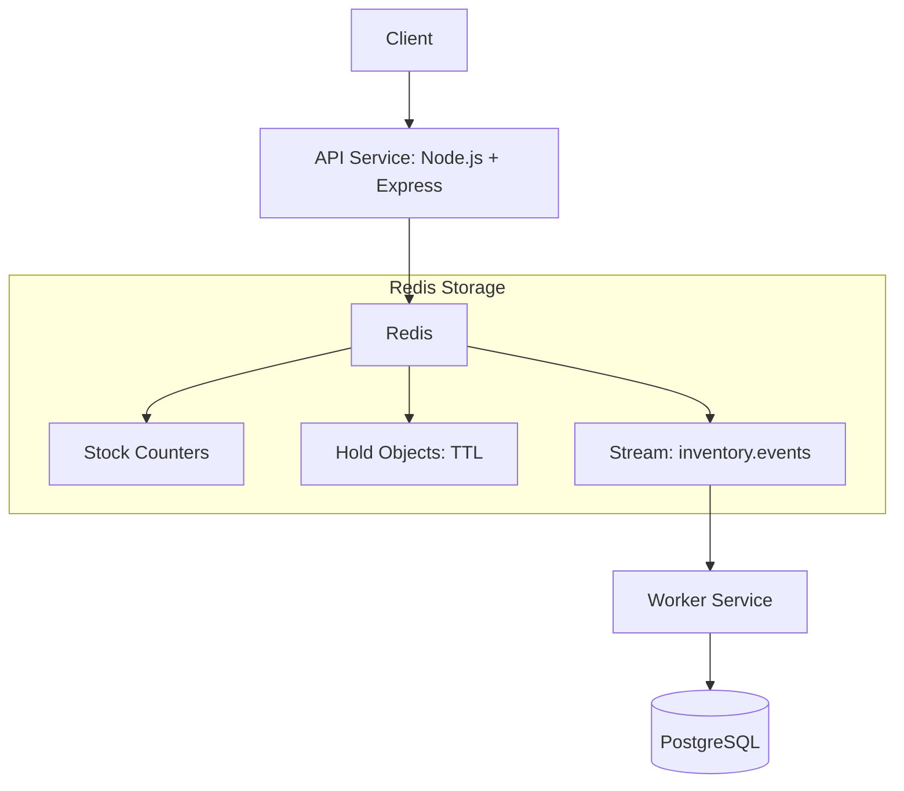

# High Concurrency Inventory Management System (Redis + PostgreSQL)


A high-performance, event-driven inventory reservation system designed to prevent overselling during high-concurrency e-commerce events (flash sales, limited drops, ticket booking, etc.).

The system uses **Redis** (hot-path concurrency control) and **PostgreSQL** (durable system of record) connected through **Redis Streams** for asynchronous persistence.

---

## Project Overview

Traditional inventory systems often fail under load because:

- Database row locks create contention
- High concurrent requests slow down checkout
- Overselling happens due to race conditions

StockStream solves this by:

- Moving reservation logic to Redis (atomic operations)
- Using Streams + Worker for async persistence
- Ensuring no oversell while keeping API latency low

## Architecture and System Design

### High-Level Flow



### Core Components

#### 1. API Service

Handles user actions such as **reserve inventory**, **confirm purchase**, and **cancel reservation**.

- Atomic stock decrement: Managed directly in Redis to prevent race conditions
- Hold creation: Implements TTL (Time-To-Live) for temporary locks
- Event publishing: Pushes data to Redis Streams
- Fast response: Database operations are removed from the critical path to minimize latency

#### 2. Redis (Hot Path Engine)

Redis serves as the high-performance layer for real-time state management.

| Key                | Purpose                                 |
| :----------------- | :-------------------------------------- |
| `stock:{sku}`      | Tracks available inventory levels       |
| `hold:{hold_id}`   | Manages temporary reservations with TTL |
| `idem:{key}`       | Ensures request idempotency             |
| `inventory.events` | The event stream for the Worker Service |

Why Redis? It provides atomic operations and sub-millisecond latency, effectively preventing PostgreSQL lock contention during high-traffic bursts.

#### 3. Worker Service

An asynchronous consumer that processes the Redis Stream to maintain the system of record.

- Events processed: `HOLD_CREATED`, `HOLD_CONFIRMED`, `HOLD_CANCELLED`
- Responsibilities:
  - Updating the `holds` table in the database
  - Generating permanent `orders`
  - Deduplicating events to ensure exactly-once processing
  - Maintaining eventual consistency between Redis and PostgreSQL

#### 4. PostgreSQL (Durable Store)

The final source of truth for all transactional data.

- `holds`: Tracks the lifecycle of every reservation
- `orders`: Stores finalized purchase records
- `processed_events`: Used for idempotent stream processing to ensure data integrity

## Consistency Model

### Strong Consistency (Inventory Safety)

The reservation logic utilizes Redis atomic operations to guarantee that stock never goes below zero. This ensures zero overselling, even under extreme high-concurrency scenarios.

### Eventual Consistency (Persistence)

The data flow from Redis -> Worker -> Postgres is asynchronous.

- Immediate response: The API responds to the user as soon as the Redis operation is successful
- Lagged persistence: Database updates happen shortly after via the worker
- Benefit: This architecture significantly reduces API latency and acts as a buffer to absorb massive traffic spikes

---

## Event-Driven Design

The system communicates state changes through structured events. Below is an example of a payload within the Redis Stream:

```json
{
  "event_id": "uuid",
  "type": "HOLD_CREATED",
  "payload": {
    "hold_id": "H-12345",
    "sku": "iphone_15_pro_256",
    "qty": 1
  }
}
```

### Reliability and Delivery

The worker ensures at-least-once delivery with idempotent writes by leveraging:

- `XREADGROUP`: Persistent consumer group management and load balancing
- `XACK`: Acknowledges successful processing and removes items from the Pending Entries List (PEL)
- Processed events table: Deduplication layer in PostgreSQL to prevent duplicate processing of the same `event_id`

---

## Tech Stack

| Component        | Technology           |
| :--------------- | :------------------- |
| Runtime          | Node.js (ESM)        |
| Web Framework    | Express.js           |
| In-Memory Store  | Redis 7 (Streams)    |
| Database         | PostgreSQL 16        |
| Containerization | Docker Compose       |
| Database Driver  | `pg` (node-postgres) |

---

## Project Structure

```text
services/
|-- api/          # HTTP layer + Redis hot path logic
|-- worker/       # Stream consumer and DB persistence
|-- shared/       # Event contracts and shared types
|-- infra/        # Docker Compose and SQL DB schema
```

---

## Setup and Run Instructions

### 1. Requirements

- Docker Desktop
- Node.js (for local development only)
- PowerShell or Bash

### 2. Start the System

Run the following command from the project root:

```bash
docker compose -f infra/docker-compose.yml up --build
```

Docker will:

- Pull the official Redis and Postgres images
- Build local images for the API and Worker services
- Start all services on the internal network

### 3. Verify Containers

```bash
docker ps
```

Expected:

- `infra-api-1`
- `infra-worker-1`
- `infra-redis-1`
- `infra-postgres-1`

---

## Testing the System

### Step 1: Seed Stock

```bash
docker exec -it infra-redis-1 redis-cli
SET stock:iphone_15_pro_256 3
```

### Step 2: Create Reservation

```bash
curl -X POST http://localhost:8080/holds/reserve \
  -H "Content-Type: application/json" \
  -d '{
    "sku":"iphone_15_pro_256",
    "qty":1,
    "user_id":"arnav",
    "idempotency_key":"idem-1"
  }'
```

Expected response:

```json
{
  "hold_id": "H-xxxx"
}
```

### Step 3: Inspect Redis State

```bash
GET stock:iphone_15_pro_256
KEYS hold:*
XRANGE inventory.events - + COUNT 5
```

### Step 4: Verify Postgres Persistence

```bash
docker exec -it infra-postgres-1 psql -U app -d inventory
SELECT * FROM holds;
SELECT * FROM processed_events;
```

### Step 5: Confirm Hold

```bash
curl -X POST http://localhost:8080/holds/confirm \
  -H "Content-Type: application/json" \
  -d '{"hold_id":"H-xxxx","payment_ref":"pay-1"}'
```

Verify:

```bash
SELECT * FROM orders;
```

### Step 6: Test No-Oversell

Reserve until stock reaches 0. Next reserve request returns `409 SOLD OUT`.

### Step 7: Test Idempotency

Repeat the same `idempotency_key`. The system returns the same `hold_id` without decrementing stock again.

---

## Debugging Tips

- Check stream messages:

```bash
XRANGE inventory.events - + COUNT 10
```

- Check consumer group:

```bash
XINFO GROUPS inventory.events
XPENDING inventory.events inventory.cg
```

- Worker logs:

```bash
docker logs -f infra-worker-1
```

---

## Design Decisions

### Why Redis Streams instead of RabbitMQ?

- Lightweight setup
- No extra infrastructure
- Built-in persistence and consumer groups
- Guarantees at-least-once delivery with idempotent DB writes

### Why Redis for Inventory?

Database locks under heavy load cause:

- Slow queries
- Timeouts
- Overselling

Redis provides atomic decrement with minimal latency.

### Why Async Worker?

Decouples API from DB load:

- API stays fast even if DB slows

---

## Future Improvements

- Lua scripts for atomic reserve
- Dead-letter stream for failed events
